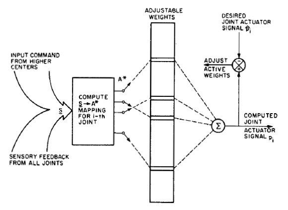
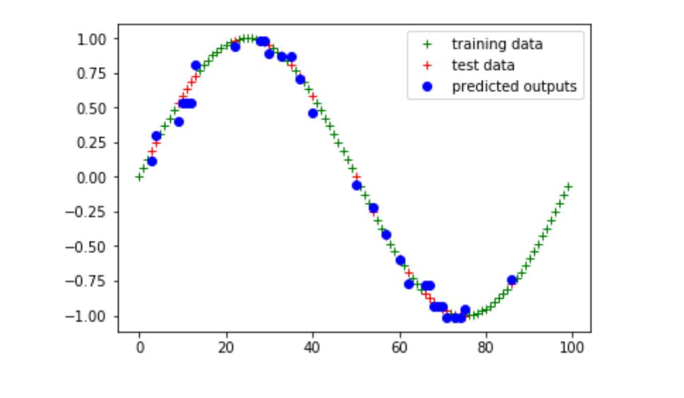

# Project - Cerebellar Model Articulation Controller

Cerebellar Model Articulation Controller (CMAC) is a model proposed by James Albus primarily used in application of robotic controllers.

<em>CMAC Controller Block Diagram</em>

This Project implementats a discrete CMAC controller
This Project implementats a continuous CMAC controller.

## Execution

### Continuous CMAC controller 
To execute the Continuous CMAC controller

`python3 src/continuous_CMAC.py`

### Continuous CMAC controller 
To execute the Discrete CMAC controller

`python3 src/discrete_CMAC.py`

## Results
The results can be found in the report CMAC_report.pdf 

<em>CMAC Controller Results</em>

